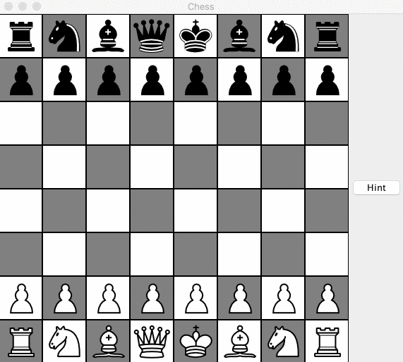

# Chess Game

The **Chess Game** is a playable chessboard that two players can take turns to play. The chessboard restricts the user to legal chess moves and provides players a "Hint" button to suggest the optimum move. It's developed using object oriented design and multi-threading concepts in Java.

*Demo*:



## Install

Clone the repository.
```bash
$ git clone https://github.com/xinjoy/chess_game.git
```

## Run
Start postgres on a new terminal tab: 
```bash
$ cd chess_game
$ javac chess_game/*.java
$ java chess_game.Main
```